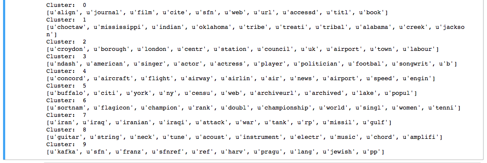

# Wiki_Topic_Modeling

### Introduction
With the massive amount of information stored in books, blogs, scientific papers and other forms of social media it's becoming increasingly difficult and time consuming to find exactly what we're looking for. Topic Modeling serves as a method to uncover hidden themes in a collection of documents. It can be applied to massives amount of data and allows us to browse, search and summarize text in new, more efficient ways!

This project utilizes Spark on AWS and the K-Means algorithm to cluster Wikipedia Articles and discover latent topics. NLP techniques such as tokenization, stemming, stop word removeal and term frequency weighting are used as pre-processing steps on the raw text.

The dataset used contains 15M articles on Wikipedia.

### Results
Initializing the KMeans model with 10 clusters provides the following results:

The clusters show some interesting results. 

Cluster 0 includes words about different forms of media.

Cluster 1 seems to be about native american tribes.

Cluster 3 mentions actor, actress, songwriter which may be about celebrities.

Cluster 4 includes words about flights and airlines.

Cluster 6 mentions sports.

Cluster 7 includes words about war and Iraq.

Cluster 8 includes words about musical instruments.

Clusters 2, 5, 9 are more difficult to decipher

### Future Work

* Find optimal clusters using elbow method.
* Tune Parameters (min_df,vocab_size).
